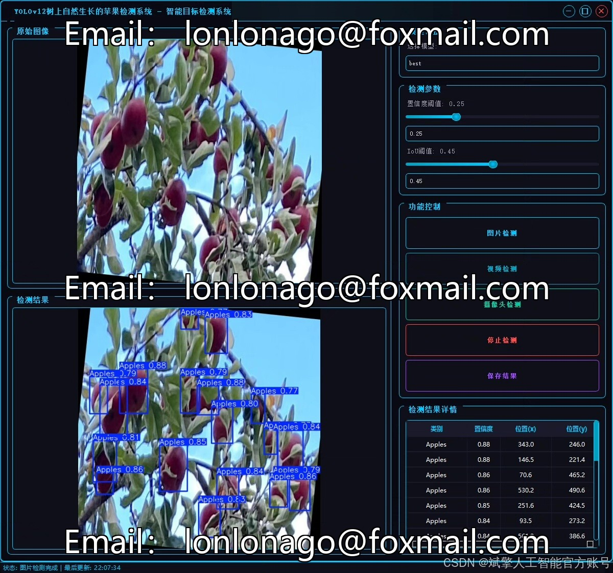
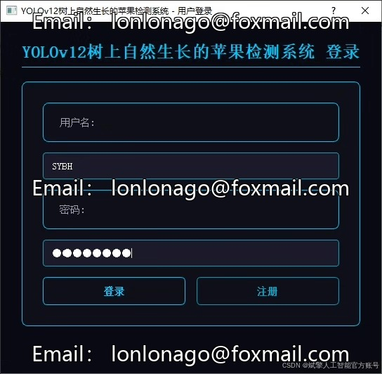
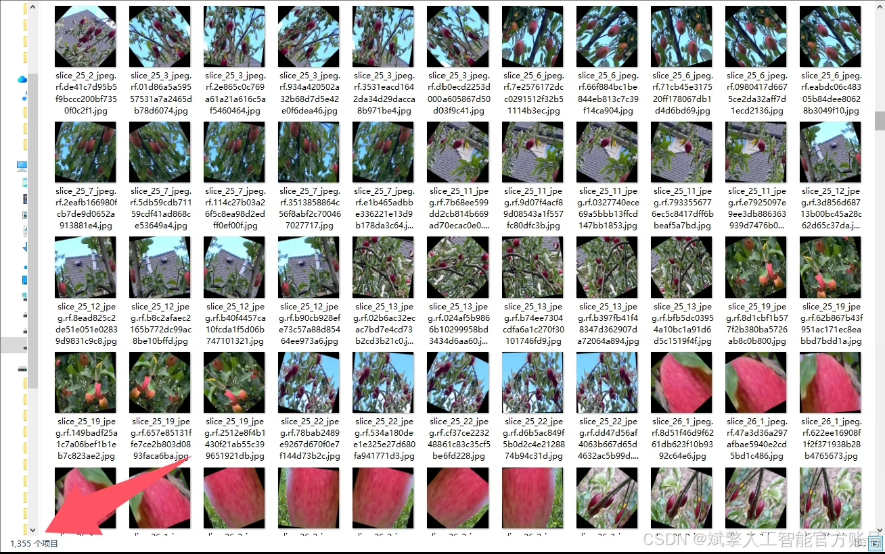
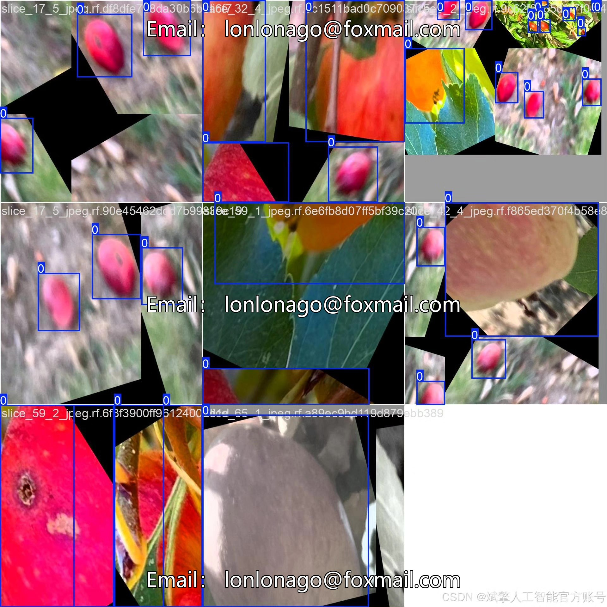
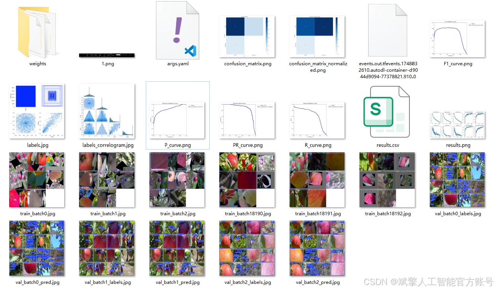

# YOLOv12 Apple Detection System

## Body

YOLOv12 Apple Detection System Based on Deep Learning: A Tree-Growing Apple Detection System (YOLOv12+YOLO Dataset+UI Interface+Login and Registration Interface+Python Project Source Code+Model)

This project has developed a tree-growing apple detection system based on deep learning, using the latest YOLOv12 object detection algorithm as its core technology. The system accurately recognizes and locates apples in natural environments, characterized by efficiency and precision. The project includes a complete Python implementation, customized YOLO dataset, user-friendly UI interface, and secure login and registration functions. The system is specifically designed for single-category ('Apples') detection and has been thoroughly trained and evaluated with 1355 training images, 77 validation images, and 39 test images, demonstrating excellent detection performance. This solution can be widely applied in fields such as smart agriculture, orchard automation management, and yield estimation, providing technical support for agricultural modernization.

✅ User Login and Registration: Supports password verification and security validation.
✅ Three Detection Modes: Based on the YOLOv12 model, supports image, video, and real-time camera detection, accurately recognizing targets.
✅ Dual-Screen Comparison: Displays the original scene and detection results simultaneously on the same screen.
✅ Data Visualization: Real-time table displays the category, confidence, and coordinates of detected targets.
✅ Intelligent Parameter Tuning: Offers a confidence slide bar to dynamically optimize detection accuracy, adapting to different scene requirements.
✅ Sci-Fi Interactive Interface: Dark theme combined with dynamic light effects, reducing visual fatigue and enhancing operational experience.

## Images

## Payment

Here is a pay link on Stripe ( https://buy.stripe.com/3cs8yP7sY87d0vu9AB ). Please contact me lonlonago@foxmail.com after funding $89, and I will send you a complete data files , thank you!

